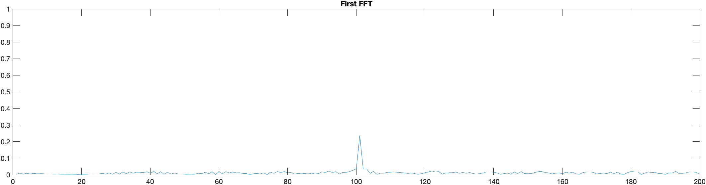
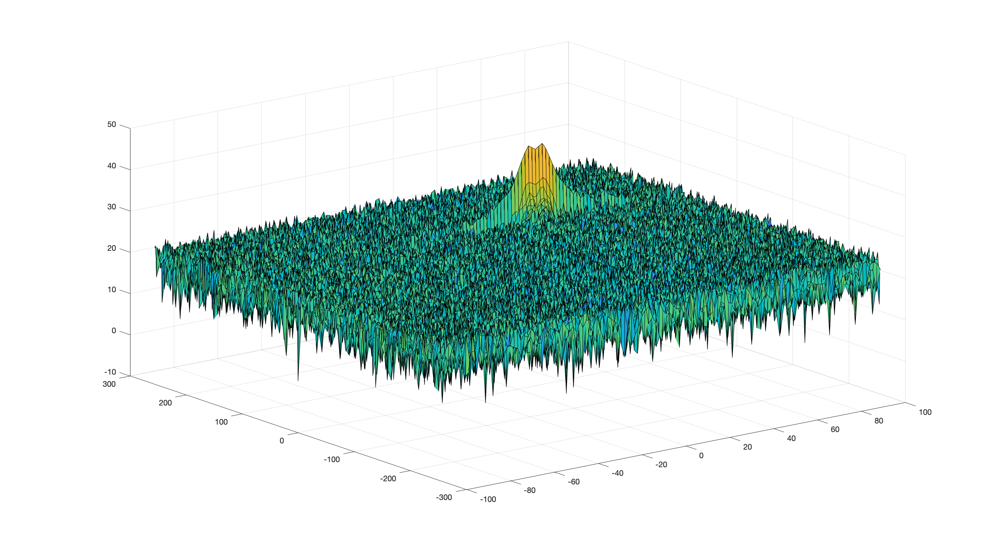

# SFND Radar Target Generation and Detection

## Goal

1. Configure the FMCW waveform based on the system requirements.
2. Define the range and velocity of target and simulate its displacement.
3. For the same simulation loop process the transmit and receive signal to determine the beat signal.
4. Perform Range FFT on the received signal to determine the Range.
5. Towards the end, perform the CFAR processing on the output of 2nd FFT to display the target.

## Radar System Requirements

System Requirements defines the design of a Radar. The sensor fusion design for different driving scenarios requires different system configurations from a Radar.

## 2D CFAR

Implementation of the 2D CFAR can be found in the 'radar_target_generation_and_detection.m' file.

1. Number of training cells and guard cells across the range dimension and doppler dimension have been chosen:

Training Cells size : [10,4]
Guard Cells size : [8,4]

2. The Cell Under Test (CUT) is examined for the whole Range Doppler Map matrix(RDM). Sliding is done to ensure enough
margin for Training and Guard cells from the margins.

3. For every CUT, the sum of the signal level across the training cells in calculated. To achieve this, the signal level for the whole windows in calculated first, then the signal level of the guard cells is subtracted. To convert the signal from logarithmic scale to linear scale, db2pow method from the Signal Processing Toolbox has been used.

4. The average signal level of the training cells is calculated and converted back to logarithmic scale using the pow2db method.

5. Appropriate offest has been added for the average training cell noise. (Threshold noise).

6. The CUT signal value is compared with the threshold noise. If the signal value is greater, there is a valid detection and the value is set to 1.

The process above will generate a thresholded block, which is smaller than the RDM as the CUTs cannot be located at the edges of the matrix due to the presence of Target and Guard cells. Hence, those cells will not be thresholded.

## Results

FFT

Doppler Range Map

2D CFAR

