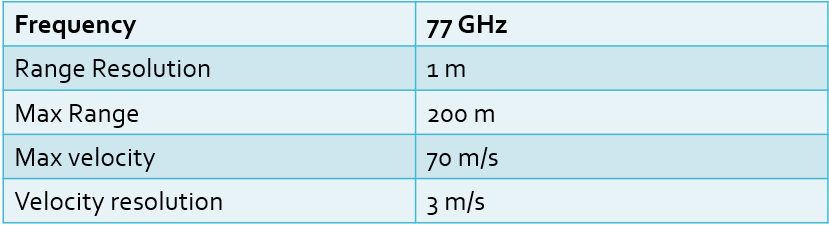
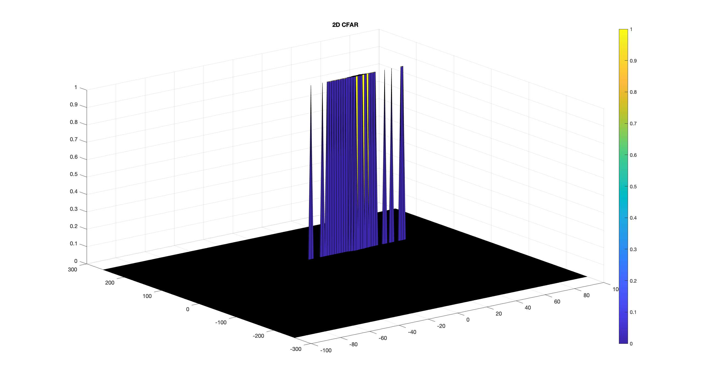

# SFND Radar Target Generation and Detection

## Goal

1. Configure the FMCW waveform based on the system requirements.
2. Define the range and velocity of target and simulate its displacement.
3. For the same simulation loop process the transmit and receive signal to determine the beat signal.
4. Perform Range FFT on the received signal to determine the Range.
5. Towards the end, perform the CFAR processing on the output of 2nd FFT to display the target.

## Radar System Requirements

System Requirements defines the design of a Radar. The sensor fusion design for different driving scenarios requires different system configurations from a Radar.

## 2D CFAR

Implementation of the 2D CFAR can be found in the 'radar_target_generation_and_detection.m' file.

Training Cells size : [10,4]
Guard Cells size : [8,4]

## Results

FFT

Doppler Range Map

2D CFAR

